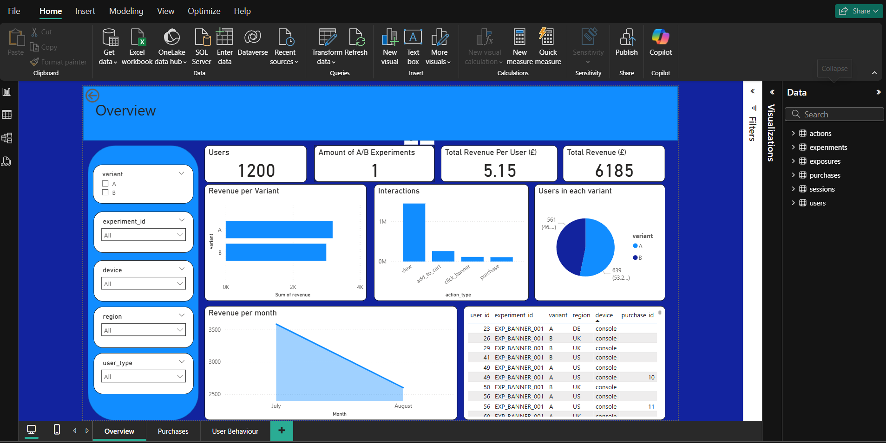
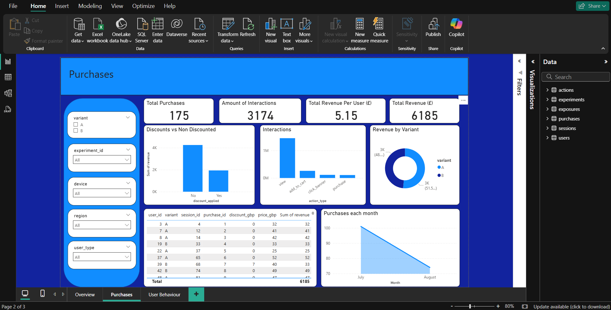
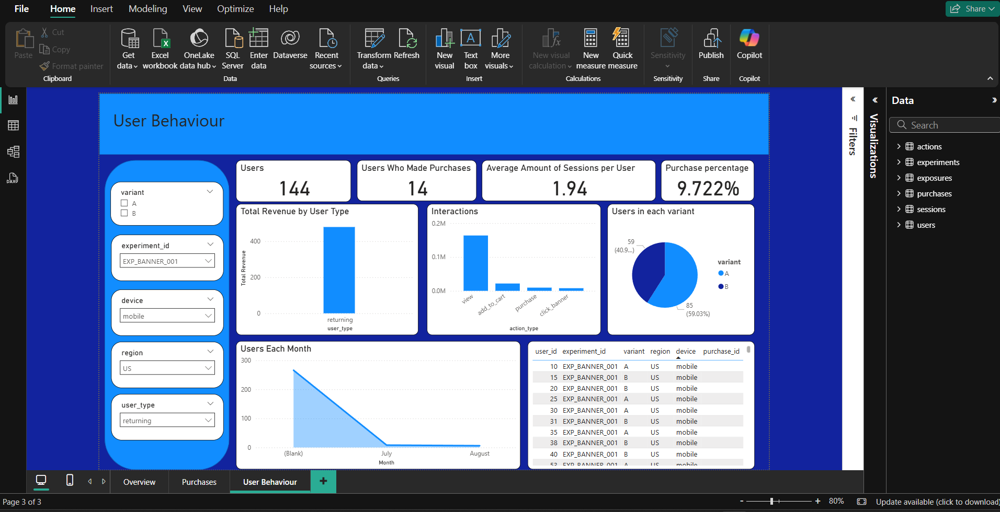

# Power BI A/B Test Insights Dashboard

This project contains an interactive **Power BI dashboard** built to analyse user behaviour and revenue outcomes from an **A/B test experiment**.  
The dataset includes user sessions, actions, exposures, purchases, and experiments.  
The dashboard helps identify differences between variants **A** and **B**, and measure overall purchase conversion and revenue metrics.

---

## Key Features

- **Overview Page**  
  - Total Users  
  - Number of Experiments  
  - Total Revenue & Revenue per User  
  - Revenue per Variant  
  - Monthly Trends  
  - Interactions Breakdown (view, add-to-cart, purchase, click-banner)  
  - Variant Distribution  

- **Purchases Page**  
  - Total Purchases  
  - Discounts vs Non-Discounts  
  - Revenue Breakdown by Variant  
  - Purchases per Month  
  - User-level purchase table  

- **User Behaviour Page**  
  - Users Who Made Purchases  
  - Average Sessions per User  
  - Purchase Conversion %  
  - Revenue by User Type (new vs returning)  
  - Monthly Active Users  
  - Variant Distribution  

---
## Power BI screenshots
<p float="left">
  
  
  
</p>


## DAX Measures Used

```DAX
-- Average number of sessions per user
Avg Sessions per User =
DIVIDE (
    DISTINCTCOUNT ( sessions[session_id] ),
    DISTINCTCOUNT ( sessions[user_id] ),
    0
)

-- Revenue per transaction
revenue =
purchases[price_gbp] - purchases[discount_gbp]

-- Purchase conversion %
Purchase Conversion % =
DIVIDE ( [Users with Purchases], DISTINCTCOUNT ( users[user_id] ), 0 )

-- Revenue per user
Revenue per User =
VAR Rev =
    SUMX ( purchases, purchases[price_gbp] - purchases[discount_gbp] )
VAR Users =
    DISTINCTCOUNT ( users[user_id] )
RETURN
    DIVIDE ( Rev, Users, 0 )

-- Total revenue
Total Revenue =
SUMX ( purchases, purchases[price_gbp] - purchases[discount_gbp] )

-- Users who made at least one purchase
Users with Purchases =
DISTINCTCOUNT ( purchases[sessions.user_id] )
